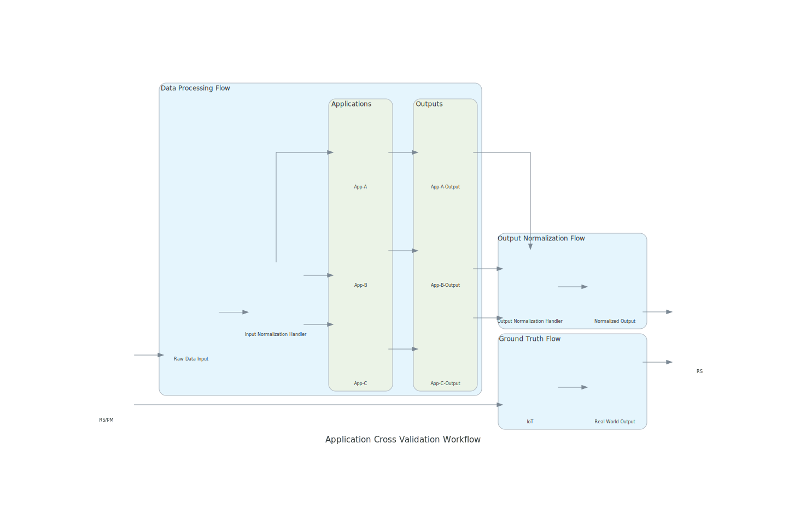

# ML Pipeline Diagram

## Demo


## Setup
> open project in Pycharm and install packages, you can run with Pycharm Configurations
```
# https://www.graphviz.org/doc/info/attrs.html
brew install graphviz
```

```
# https://diagrams.mingrammer.com/docs/getting-started/examples
pip3 install diagrams
```

## Reference
- https://diagrams.mingrammer.com/docs/getting-started/installation