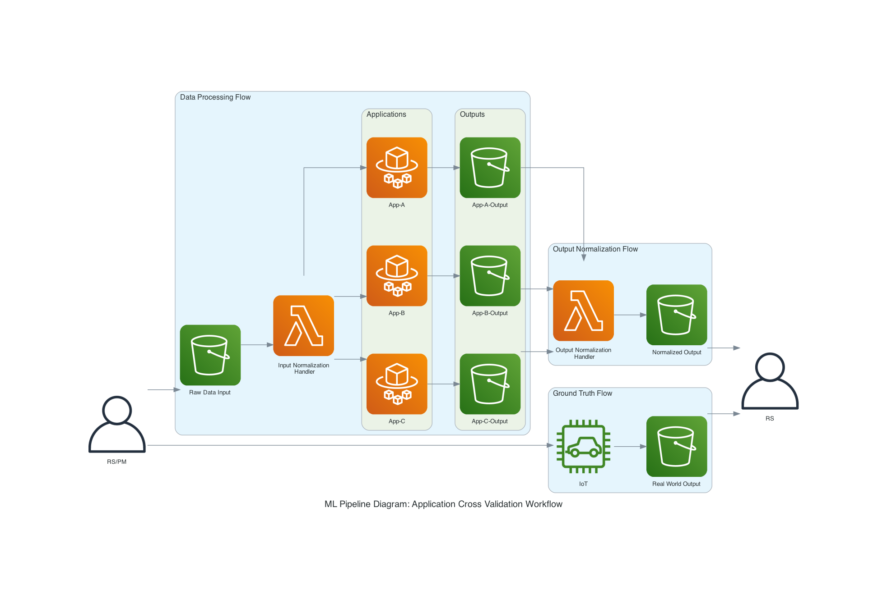

# ML Pipeline Diagram

## Demo


## Setup
> open project in Pycharm and install packages, you can run with Pycharm Configurations
```
# https://www.graphviz.org/doc/info/attrs.html
brew install graphviz
```

```
# https://diagrams.mingrammer.com/docs/getting-started/examples
pip3 install diagrams
```

## Social Preview
- Update github social preview with 1280x640 image
  - https://docs.github.com/en/repositories/managing-your-repositorys-settings-and-features/customizing-your-repository/customizing-your-repositorys-social-media-preview